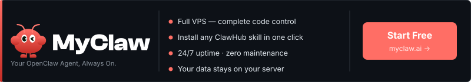

# awesome-openclaw-skills · Sponsor Preview

> ⚠️ This is a **draft preview** of MyClaw.ai's sponsor placement in the [VoltAgent/awesome-openclaw-skills](https://github.com/VoltAgent/awesome-openclaw-skills) repository.

---

## OpenClaw Ecosystem Tools

OpenClaw agents can interact with external services like GitHub, Slack, Gmail, and more. You can build integrations yourself with Skills or Plugins, or use a managed service to handle auth, token refresh, and permissions across all your connections.

---

### 🟣 Sponsor

**[MyClaw.ai](https://myclaw.ai?utm_source=github&utm_campaign=awesome-openclaw-skills)** · Run all these skills without managing a server. Get a full cloud-hosted OpenClaw instance with one-click setup, 24/7 uptime, and complete data ownership. [Get started free →](https://myclaw.ai?utm_source=github&utm_campaign=awesome-openclaw-skills)

---

## Text-only variant (simpler)

> For repos that don't allow image sponsors:

**[MyClaw.ai](https://myclaw.ai)** — The managed home for your OpenClaw agent. Full server, all your skills, always on — no DevOps required. [Get started free →](https://myclaw.ai?utm_source=github&utm_campaign=awesome-openclaw-skills)

---

## About this preview

- Banner size: 800×160px
- Background: GitHub dark-mode native (`#0D1117`)
- Renders in both light and dark mode on GitHub
- SVG uses system fonts — renders correctly everywhere
